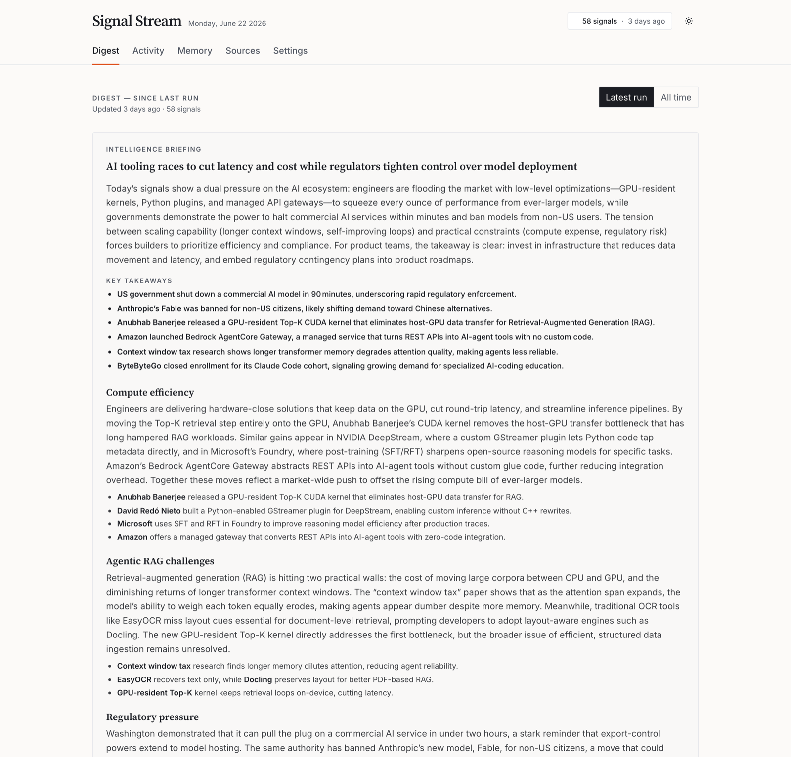
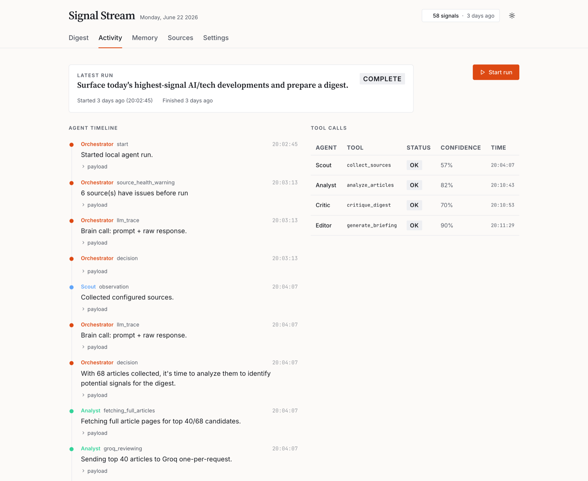
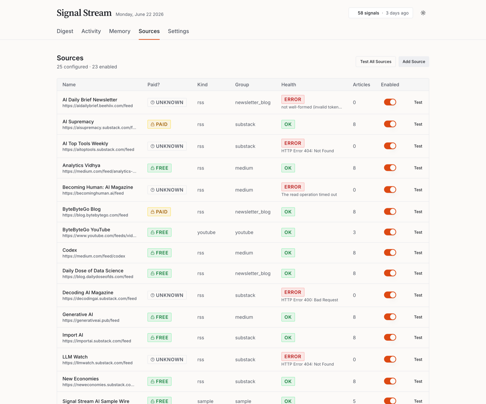
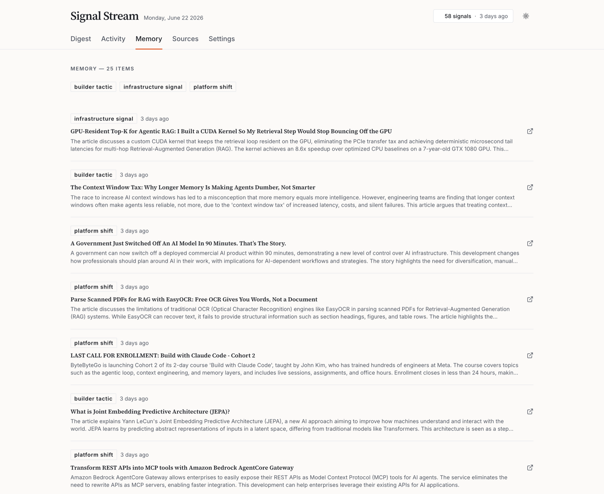
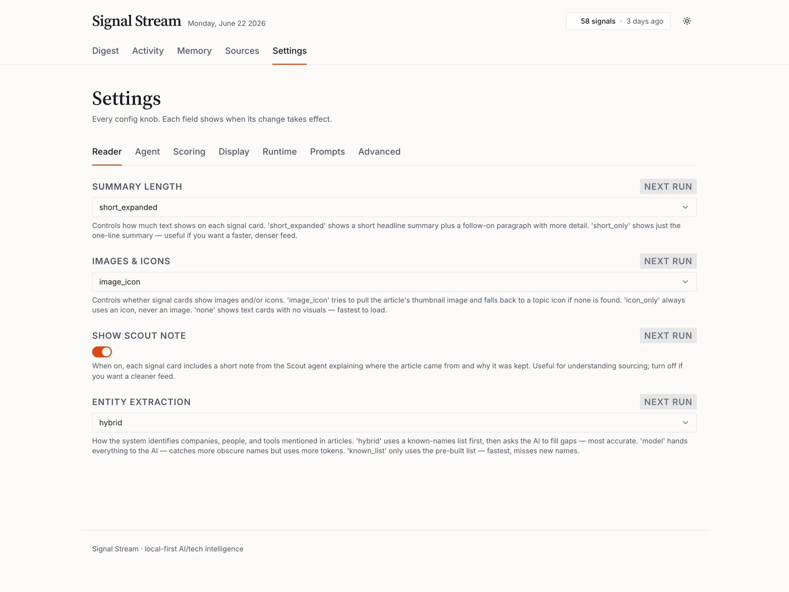
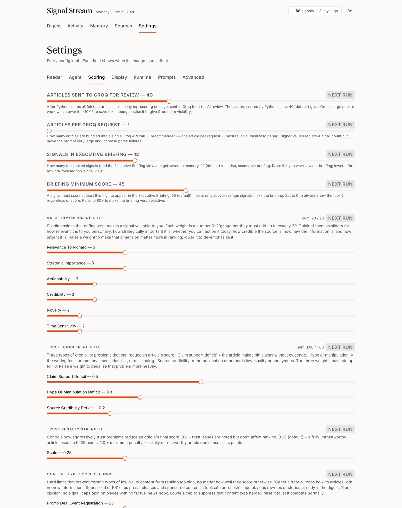

# Signal Stream

**Your on-demand AI/tech intelligence brief — run by a team of cooperating agents, on your machine.**

Signal Stream pulls from ~25 AI/tech sources, scores every story against *your* priorities, has a hosted model review the best candidates, and hands you a ranked digest plus a one-screen executive briefing. It runs locally, keeps its memory in a local database so it never re-serves yesterday's news, and ships with a dashboard where you can read, drill in, and re-tune everything without touching code.



---

## What it is (and why)

Most "AI news" feeds optimize for volume. Signal Stream optimizes for **signal** — the handful of developments that should actually change a decision.

It's built around one question, applied to every article: *should you rely on this for a product, strategy, leadership, or AI-market decision?* Stories that are hype, promo, generic tutorials, or yesterday's repeat get cut. What survives is ranked, summarized in plain English, and tied back to *why it matters*.

**Who it's for:** product managers, founders, operators, and investors who need to stay current on frontier AI without reading 200 posts a day.

**The design in one line:** Python does the deterministic work (fetching, deduping, scoring), a hosted model does the judgment calls (reviewing the top candidates, writing the briefing), and *you* own the priorities, prompts, and scoring weights.

> Signal Stream started as a *Design for AI* project at Carnegie Mellon (Tepper) and is conceptually linked to a broader idea called **SignalIQ**.

### At a glance

| | |
|---|---|
| **Runs** | Locally, on demand — no scheduler or cloud account required |
| **Brain** | Groq-hosted models for agent judgment and article review |
| **Memory** | Local SQLite database, so repeats get dropped automatically |
| **Backend** | Python 3.11+, standard library only except `youtube-transcript-api` (the sole pip dependency, used to pull YouTube captions) |
| **Dashboard** | React + Vite + shadcn/ui, served by the Python app (with a no-build fallback) |
| **You configure** | Sources, priorities, scoring weights, prompts, and display — from the dashboard or a single config file |

---

## A tour of the dashboard

Everything below is the live dashboard reading a real run. Build the frontend once (see [Quick start](#quick-start)) and visit `http://127.0.0.1:8765`.

### Digest — the ranked brief

The landing page opens with the **Intelligence Briefing** (a synthesized read of the day: headline, key takeaways, themes, and what to watch), then a ranked list of signal cards. Each card shows the score, source, urgency, an article image or topic icon, and a 2–3 sentence editorial summary.


### Signal detail — the full read on one story

Click any card for the deep view: category and score badge, the editorial summary, the source and date, the article image, and an expanded markdown briefing (lede, specifics, and a bold "why it matters"). Detail pages also surface extracted entities and related signals.


### Activity — watch the agents work

A live, replayable trace of the run. The **Agent Timeline** shows each Orchestrator decision, Scout/Analyst/Critic/Editor step, and model call (expand any row for the raw payload). The **Tool Calls** panel summarizes which agent did what, with status and confidence. A **Start run** button kicks off a fresh run.



### Sources — health at a glance

Every configured source with its feed type (paid/free), kind, group, health (OK / error detail), article count, and an enable toggle. **Test** any source on demand, **Test All Sources**, or **Add Source** — all without editing files.



### Memory — what it already knows

The running record of past signals, filterable by category. This is what lets Signal Stream drop exact repeats and treat each run as a continuation, not day one.



### Settings — re-tune the whole system

Every knob, grouped into tabs, each field labeled with **when its change takes effect**. The Reader tab below controls how the digest reads; the Scoring tab (further down) exposes the full ranking rubric.





---

## Quick start

**Prerequisites:** Python 3.11+, a [Groq API key](https://console.groq.com/keys), and Node.js (only needed to build the dashboard UI).

```bash
# 1. Export your Groq key — the app does NOT auto-load .env
export GROQ_API_KEY=<your-key>

# 2. Build the dashboard UI once (optional — a legacy UI works without it)
cd web && npm install && npm run build && cd ..

# 3. Run a digest
python3 -m signal_stream agent run --config configs/ai_tech.toml

# 4. Open the dashboard
python3 -m signal_stream dashboard --config configs/ai_tech.toml
# visit http://127.0.0.1:8765
```

**No API key yet?** You can still explore the dashboard against an existing run, and there's an offline smoke-test mode (see [Try it offline](#try-it-offline)).

---

## What you can change

This is the point of Signal Stream: **you tune it.** Almost everything is editable from the dashboard **Settings** page, which writes to a single human-readable file (`configs/agent_brain.toml`). A few runtime settings live in `configs/ai_tech.toml`.

### Settings tabs

| Tab | What it controls | Stored in | Takes effect |
|---|---|---|---|
| **Reader** | Summary length, article images vs. icons, scout-note visibility, entity extraction style | `agent_brain.toml` | Next run / page load |
| **Agent** | Scout & Analyst modes, relevance policy, how far the model may adjust a score, Critic on/off and thresholds | `agent_brain.toml` | Next run |
| **Scoring** | How many articles the model reviews, value-dimension weights, trust penalties, and score ceilings (see below) | `agent_brain.toml` | Next run |
| **Display** | Cards per page, and whether the digest defaults to the latest run or all runs | `agent_brain.toml` | Next page load |
| **Runtime** | Source list, Groq model, ports, iteration limits | `ai_tech.toml` | **Restart required** |
| **Prompts** | The actual instructions for each agent (Orchestrator, Scout, Analyst, Critic, Editor) | `agent_brain.toml` | Next run |
| **Advanced** | Raw TOML editor plus a read-only list of advanced-only knobs | `agent_brain.toml` | Next run |

### Your priorities and scoring

Python owns the base score so it's transparent and reproducible; the model only adjusts within a bounded limit. You control the whole rubric:

- **Priority groups** — the seven topic areas Signal Stream watches (frontier launches, agents/dev tools, enterprise adoption, infrastructure/chips, startups/funding, regulation/safety, builder tactics), each with its own keywords and weight. Edit them in `ai_tech.toml`.
- **Value-dimension weights** — relevance, strategic importance, actionability, credibility, novelty, time-sensitivity (must sum to 20).
- **Trust penalties** — how hard to discount thin claims, hype, and weak sources.
- **Score ceilings** — hard caps for low-value patterns (promos, generic tutorials, listicles, stale repeats).
- **Match bands** — how many points to award for priority match, watchlist-company match, and event strength.

Plain-English walkthrough: [docs/SCORING_RUBRIC.md](docs/SCORING_RUBRIC.md).

### Behavior modes

Each agent can lean more or less on the model:

- `code` — Python logic only
- `hybrid` — Python first, then model judgment where it helps (default)
- `model` — lean harder on the model's judgment

### Sources

Add, enable, disable, or test any source from the **Sources** page, or edit `configs/ai_tech.toml` directly:

```toml
[[sources]]
name = "Source Name"
kind = "rss"          # rss | atom | youtube | html_scrape | sample | report
group = "substack"    # medium | substack | newsletter_blog | youtube | on_demand | sample
url = "https://example.com/feed"
limit = 8
enabled = true
```

For YouTube, use `kind = "youtube"` and add a `channel_id`. For archive-style sites, use `kind = "html_scrape"` with an `article_link_pattern`.

### Config file map

| File | Owns |
|---|---|
| [`configs/agent_brain.toml`](configs/agent_brain.toml) | Prompts, behavior switches, scoring weights/caps/bands, top-N knobs, display prefs — the file the Settings page edits |
| [`configs/ai_tech.toml`](configs/ai_tech.toml) | Profile, sources, priority groups, storage path, delivery settings, Groq model config |
| [`configs/demo.toml`](configs/demo.toml) | Offline/demo brain settings for the smoke test |

`signal_stream/prompts.py` holds fallback copies only — `agent_brain.toml` is the source of truth.

---

## How it works

### The agents

Four roles cooperate, coordinated by the Orchestrator:

- **Orchestrator** — the decision-maker. Runs an observe → reason → act loop and decides whether to collect sources, analyze, critique, or finalize.
- **Scout** — collects and normalizes sources (RSS, Atom, YouTube, `html_scrape`, reports). Pure Python, no model call; reports source health back.
- **Analyst** — deduplicates, checks memory, scores with the Python rubric, clusters, fetches full pages for the top candidates, then has the model review them one at a time.
- **Critic** *(optional, on by default)* — reviews the proposed digest and can trigger one revision round before it ships.
- **Editor** — synthesizes the top signals into the executive briefing (can use a stronger model than per-article review).

### The run lifecycle

1. Find the most recent completed run.
2. Fetch configured sources newer than that run, with a 6-hour overlap.
3. Drop articles already seen by prior complete runs.
4. Cluster articles and extract entities.
5. Score each candidate with the Python rubric.
6. Fetch full pages for the top 40 candidates.
7. Send those 40 to the model, one article per request.
8. Critic reviews the digest; if it's weak, one revision round runs.
9. Publish up to 40 ranked signals.
10. Editor writes the executive briefing from the top 12.
11. Atomically persist articles, signals, dashboard events, and the run status.
12. Save the top 12 to memory for future deduplication.

Only a **complete** run advances the cursor. Failed or interrupted runs don't mark new articles as "seen," so nothing is silently lost.

### Sources included

The default registry (`configs/ai_tech.toml`) covers ~25 sources:

- **Medium:** Towards AI, Towards Data Science, Analytics Vidhya, Becoming Human, Codex, Generative AI
- **Substack / newsletters:** AI Supremacy, New Economies, The Sequence, LLM Watch, Import AI, AI Top Tools Weekly, Decoding AI Magazine, The Neural Maze
- **Newsletter blogs:** Turing Post (archive scrape), The Pragmatic Engineer, Daily Dose of Data Science, AI Daily Brief, ByteByteGo
- **YouTube:** ByteByteGo, The AI Daily Brief
- **On-demand report (off by default):** State of AI
- **Offline smoke-test wire:** Signal Stream AI Sample

---

## Commands

```bash
# Check system health (config, DB path, API key, source count)
python3 -m signal_stream doctor --config configs/ai_tech.toml

# Run a digest
python3 -m signal_stream agent run --config configs/ai_tech.toml

# Start the dashboard (http://127.0.0.1:8765)
python3 -m signal_stream dashboard --config configs/ai_tech.toml

# Inspect memory and stored signals
python3 -m signal_stream memory show --config configs/ai_tech.toml
python3 -m signal_stream show --config configs/ai_tech.toml --limit 10
```

### Develop the UI with hot reload

```bash
# Terminal 1: Python API server
python3 -m signal_stream dashboard --config configs/ai_tech.toml

# Terminal 2: Vite dev server (proxies /api to port 8765)
cd web && npm run dev
# visit http://localhost:5173
```

### Try it offline

To run without live sources or a key, enable `Signal Stream AI Sample Wire` in `configs/ai_tech.toml`, disable the live sources, and use the demo brain settings from `configs/demo.toml`.

---

## Documentation

- [docs/PLAIN_ENGLISH_GUIDE.md](docs/PLAIN_ENGLISH_GUIDE.md) — no-jargon tour of the code layout
- [docs/EDIT_THE_BRAIN.md](docs/EDIT_THE_BRAIN.md) — operator guide to editing prompts, scoring, and settings
- [docs/SCORING_RUBRIC.md](docs/SCORING_RUBRIC.md) — plain-English scoring rubric
- [docs/ARCHITECTURE.md](docs/ARCHITECTURE.md) — system architecture
