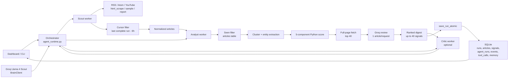

# Signal Stream Architecture

Signal Stream is a local runtime with a hosted model brain. The Orchestrator is the only component with decision rights; Scout, Analyst, and Critic are worker processes with bounded tools and isolated contexts.



## Current Status

- Hosted API support is **DONE** through Groq and `BrainClient`.
- The active model is `meta-llama/llama-4-scout-17b-16e-instruct`.
- The backend remains stdlib-only except for `youtube-transcript-api`, used by the YouTube transcript fetcher.
- The active product path is `python3 -m signal_stream agent run --config configs/ai_tech.toml`.
- The React dashboard is the primary UI, with the Python inline dashboard as fallback.

## Why This Fits Signal Stream

- The Orchestrator chooses actions from observations, so the system is agentic instead of a fixed automation.
- Scout, Analyst, and Critic are separate worker processes, which keeps responsibilities clear.
- The cursor and seen-set let the system process current material without repeating prior complete runs.
- The scoring rubric is deterministic and inspectable before Groq applies judgment.
- The dashboard exposes decisions, source health, stages, tool calls, signal details, scoring breakdowns, memory, and settings.

## The Four Roles In Practice

Each role has its own prompt in [`../configs/agent_brain.toml`](../configs/agent_brain.toml) and its own narrow toolbox. Tools are plain Python functions, not model-native tool calls.

| Role | File | Prompt block | Responsibility |
|---|---|---|---|
| **Orchestrator** | `signal_stream/agent_runtime.py` | `[orchestrator]` | Chooses actions, reads state, manages worker calls, finalizes runs |
| **Scout** | `signal_stream/worker.py`, `signal_stream/source_tools.py` | `[scout]` | Fetches sources, applies cursor, normalizes articles, extracts source images |
| **Analyst** | `signal_stream/worker.py`, `signal_stream/analysis_tools.py` | `[analyst]` | Seen filtering, clustering, scoring, page fetching, Groq review, summaries |
| **Critic** | `signal_stream/worker.py`, `signal_stream/analysis_tools.py` | `[critic]` | Optional digest quality review and revision requests |

Tools are not shared. Scout owns ingestion. Analyst owns analysis. Critic owns quality review.

## How The Brain Calls The Agents

The Orchestrator never fetches or analyzes directly. It picks an action verb, then `_call_worker(client, action, params)` sends that verb to the correct worker subprocess. The worker dispatcher maps the verb to the Python helper, such as `fetch_source()` or `analyze_articles()`.

The fixed action set is:

- `collect_sources`
- `analyze_articles`
- `collect_more_context`
- `critique_digest`
- `finalize_digest`

The order is not fixed. The Orchestrator decides based on accumulated state, source results, Analyst output, and Critic notes.

## Run Lifecycle

```text
[CLI or dashboard Run button]
            |
            v
SignalAgentRuntime.run()
            |
            v
start agent_runs row with status="running"
            |
            v
Orchestrator decision loop
            |
            +--> collect_sources
            |       Scout reads latest complete run cursor
            |       cursor = started_at - 6 hours
            |       first run: no cursor, use source limits
            |       fetch RSS / Atom / YouTube / html_scrape / sample / report
            |       cap cursor matches to 20 per source
            |       emit source_capped events when needed
            |
            +--> analyze_articles
            |       Analyst drops already-seen articles
            |       dedupe exact within-run repeats
            |       cluster related coverage
            |       extract entities and matched priorities
            |       score with _base_score_card()
            |       sort by Python score
            |       fetch full pages for top 40
            |       send top 40 to Groq one article per request
            |       merge score adjustments within configured limit
            |
            +--> critique_digest (optional)
            |       Critic scores the proposed digest
            |       revision notes can send the loop back to analysis
            |
            +--> finalize_digest
                    write Markdown digest
                    save articles + signals + complete status atomically
                    use top 12 signals for executive summary + memory
```

Activity stages surfaced to the dashboard include `collecting`, `filtering`, `clustering`, `scoring`, `fetching_full_articles`, `groq_reviewing`, `writing_digest`, `complete`, and `failed`.

## Persistence Model

All state lives in SQLite through [`../signal_stream/storage.py`](../signal_stream/storage.py).

| Table | What's in it |
|---|---|
| `runs` | Legacy completed-run summary: timestamps, article count, cluster count, signal count, output path |
| `agent_runs` | Modern run tracker: `id`, `goal`, `status`, `started_at`, `completed_at`, `summary_json` |
| `articles` | Normalized fetched articles persisted only after a complete agent run |
| `signals` | Ranked digest signals with summaries, score, urgency, event type, score breakdown, entities, image URL, icon key, and legacy compatibility fields |
| `agent_events` | Orchestrator and worker events for the activity timeline |
| `tool_calls` | Worker calls with input/output JSON, status, confidence, and errors |
| `memory_items` | Top executive-summary signals saved for repeat detection |
| `feedback` | User labels that feed future priority adjustments |

Status conventions:

- `"running"`: run has started and is still active
- `"complete"`: run finalized and `save_run_atomic()` persisted articles and signals
- `"failed"`: exception, worker failure, dashboard stale-run sweep, or interrupted process cleanup
- `"interrupted"`: max iterations exhausted before finalization

Only `"complete"` advances the cursor. This is the key persistence guarantee.

## Atomic Save

`save_run_atomic()` is the agentic path for successful runs. It inserts articles, inserts signals, creates the legacy `runs` row, and flips `agent_runs.status` to `"complete"` inside one SQLite transaction.

If any write fails, SQLite rolls the transaction back. That means articles are not marked seen, signals are not partially saved, and the cursor does not move.

## Cursor And Seen Filtering

The run cursor is:

```text
latest complete agent run started_at - 6 hours
```

On the first run, there is no cursor, so each source uses its configured limit. On later runs, Scout filters feed entries to those newer than the cursor and keeps at most 20 new entries per source. Analyst then checks `storage.is_article_seen(article.id, article.url)` before scoring.

The overlap catches late feed publication and clock-skew edge cases; the seen filter removes duplicates created by that overlap.

## Scoring And Groq Review

The Python score source is `_base_score_card()` in `analysis_tools.py`.

Component caps:

- priority match: 25
- company match: 25
- recency: 15
- event strength: 25
- corroboration: 10

After scoring and sorting, Analyst fetches full article pages for the top `analyst_review_limit` candidates, currently 40. Then it asks Groq to review them with `analyst_review_batch_size = 1`.

Groq receives the article text, Python score, score breakdown, event type, matched priorities, entities, and source notes. It writes the final summaries and can adjust the score by up to `model_score_adjustment_limit`, currently 20.

## Dashboard Routes

- `/` — Digest of latest signals with cards, images/icons, and executive summary
- `/activity` — Agent timeline, stages, progress, and tool calls
- `/memory` — Memory items used for repeat detection
- `/signal/:id` — Detail view with expanded summary, score breakdown, entities, and related signals
- `/settings` — Edit prompts, scoring bands, priority groups, top-N settings, source limits, and display settings

The signal list endpoint intentionally omits `score_breakdown` for slimmer payloads. The detail endpoint includes the full breakdown.

## Changing Agent Behavior Without Code

Almost everything an operator should tune lives in [`../configs/agent_brain.toml`](../configs/agent_brain.toml), editable from the dashboard Settings page.

| What to change | Where |
|---|---|
| Agent prompts | `[orchestrator]`, `[scout]`, `[analyst]`, `[critic]` |
| Critic behavior | `[behavior].enable_critic`, `critic_score_threshold`, `max_critic_rounds` |
| Model usage mode | `[behavior].scout_mode`, `[behavior].analyst_mode` |
| Top-N model review | `[behavior].analyst_review_limit`, `analyst_review_batch_size`, `analyst_full_review` |
| Executive summary size | `[behavior].executive_summary_limit` |
| Score component weights | `[scoring.components]` |
| Score bands | `[scoring.recency_bands]`, `[scoring.event_strength_bands]`, `[scoring.priority_match_bands]`, `[scoring.company_match_bands]`, `[scoring.corroboration_bands]` |
| Dashboard display | `[display].page_size`, `[display].default_scope` |

Source-list configuration and priority groups live in `configs/ai_tech.toml`.

## Upgrade Path

- Add a scheduler or hosted runtime after on-demand behavior is stable.
- Add email and Slack delivery once dashboard runs are trusted.
- Add a rejected-articles view for fetched material that did not become signals.
- Improve full-page extraction if stdlib parsing proves too noisy for specific sources.
