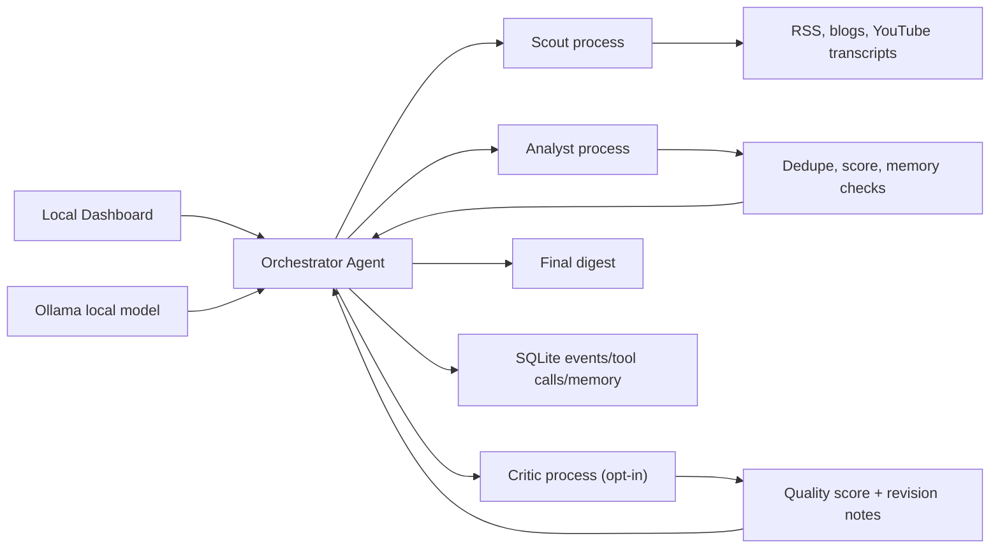

# Signal Stream Architecture

Signal Stream is designed as a local-first agent runtime. The Orchestrator is the only component with decision rights; Scout and Analyst are independent worker processes with bounded tools and isolated contexts.



## Why This Fits Signal Stream

- The Orchestrator chooses actions based on observations, which makes the system agentic rather than a fixed automation.
- Scout and Analyst are separate processes, so they are real subagents for the local MVP.
- The Critic closes the loop: instead of shipping immediately after the Analyst, the Orchestrator can request a review pass and revise before finalizing. This is the reflection step that separates an agentic system from a pipeline.
- Memory is SQLite, so the system can avoid repeating prior coverage.
- The dashboard exposes the agent trace, which makes behavior inspectable during demos.

## Critic / Reflection Loop

When `enable_critic = true` (in `configs/agent_brain.toml`), the Orchestrator gains a new action: `critique_digest`. After the Analyst produces ranked signals, the Orchestrator picks `critique_digest` and the Critic worker scores the digest 0–100. If the score is below `critic_score_threshold` and revision rounds remain, the Critic's revision notes are added to the Orchestrator's next decision context, prompting it to `analyze_articles` again or `collect_more_context`. The loop exits when the score is at or above the threshold, or `max_critic_rounds` is exhausted.

## Upgrade Path

- Add email and Slack delivery once local dashboard runs are trusted.
- Add hosted API support behind the same Ollama client interface.
- Add embeddings for better clustering and memory matching.
- Add a scheduler or hosted runtime after on-demand agent behavior is stable.

---

## The four roles in practice

Signal Stream is a multi-agent loop running inside a single Python process.
There are four roles. Each role has its own prompt (in
[`../configs/agent_brain.toml`](../configs/agent_brain.toml)) and its own narrow
toolbox. **Tools are plain Python functions, not LLM tool-calls** — the
orchestrator picks an action verb and the worker routes that verb to the
matching helper.

| Role | File | Prompt block | Tools |
|---|---|---|---|
| **Orchestrator** (the brain) | `signal_stream/agent_runtime.py` `SignalAgentRuntime.run()` | `[orchestrator]` | None — chooses actions, reads state |
| **Scout** | `signal_stream/worker.py` + `source_tools.py` | `[scout]` | `fetch_source`, `fetch_context`, `enrich_articles_with_model` |
| **Analyst** | `signal_stream/worker.py` + `analysis_tools.py` | `[analyst]` | `analyze_articles` (clusters, dedupes, scores, summarizes) |
| **Critic** (opt-in) | `signal_stream/worker.py` + `analysis_tools.py` | `[critic]` | `score_digest_quality` |

**Tools are not shared.** Scout owns ingestion. Analyst owns analysis. Critic
owns quality scoring. There is no shared toolbox.

## How the brain calls the agents

The orchestrator never calls a tool directly. It only picks an action verb,
and `_call_worker(client, action, params)` (in `agent_runtime.py`) sends that
verb to the matching worker subprocess. The worker has a small dispatcher
that maps the verb to the correct Python helper (e.g. `analyze_articles` →
`analysis_tools.analyze_articles(...)`).

This is what keeps the system agentic rather than scripted: the orchestrator
sees what state has accumulated and decides whether to fetch more, analyze,
critique, or finalize. The action set is fixed (`collect_sources`,
`analyze_articles`, `collect_more_context`, `critique_digest`, `finalize_digest`),
but the order is not.

## End-to-end run trace

```
[CLI / dashboard "Run" button]
            │
            ▼
SignalAgentRuntime.run()  ← brain loop starts
            │
   ┌────────┴── iteration 1 ──┐
   │ _decide(): "collect_sources"  │
   │ → Scout.fetch_source × N feeds│
   │ → state["articles"] populated │
   └───────────────────────────────┘
            │
   ┌────────┴── iteration 2 ──────────────┐
   │ _decide(): "analyze_articles"        │
   │ → Analyst.analyze_articles           │
   │   • dedupe (ClusterAgent)            │
   │   • entity extraction                │
   │   • RelevanceAgent score             │
   │   • LLM adjustment (hybrid mode)     │
   │   • write short_summary,             │
   │     expanded_summary, why_it_matters │
   │ → state["analysis"]["signals"]       │
   └──────────────────────────────────────┘
            │
   ┌────────┴── iteration 3 (if Critic) ─┐
   │ _decide(): "critique_digest"        │
   │ → Critic.score_digest_quality       │
   │ if score < threshold && rounds left:│
   │   loop back to analyze_articles     │
   │   with revision notes               │
   └─────────────────────────────────────┘
            │
            ▼
Finalize: write Markdown digest, save run +
signals + memory items to SQLite. Dashboard
reads SQLite via /api/signals.
```

## Persistence — where everything is logged

All state lives in `signal_stream.db` (SQLite) via
[`../signal_stream/storage.py`](../signal_stream/storage.py).

| Table | What's in it |
|---|---|
| `runs` | One row per completed agent run: `started_at`, `completed_at`, `article_count`, `signal_count`, `output_path` |
| `agent_runs` | Modern run tracker with `status` (running/completed/failed) — what the dashboard polls for live state |
| `signals` | Every analyzed signal: title, score, urgency, event_type, summaries, why_it_matters, entities |
| `articles` | Raw normalized articles fetched by Scout (deduplicated by hash) |
| `agent_events` | One row per orchestrator decision and per worker event (joined to `agent_runs` via `run_id`) |
| `tool_calls` | One row per worker call with input/output JSON, status, confidence |
| `memory_items` | Topic memory used for repeat-detection across runs |
| `feedback` | User labels (critical/useful/not_useful/irrelevant) — fed back into scoring on next run |

**On the dashboard:**

- `/` — Digest of latest signals (paged, scope-toggle between latest run and all-time)
- `/activity` — Agent timeline (events) + tool call table for the latest run
- `/memory` — Memory items used to suppress repeats
- `/signal/:id` — Detail view of one signal
- `/settings` — Edit the brain TOML (prompts, scoring, behavior, display)

## Where things are *not* logged (yet)

Raw articles that Scout fetches but that never become a signal (filtered out,
deduplicated against memory, scored too low to publish) are stored in the
`articles` table but are **not surfaced as "rejected" anywhere on the dashboard**.
They are inputs to the Analyst, not outputs.

If you want to see "things not considered signals," that's a future feature —
it would need a `rejected_articles` log written by the Analyst with reasons.

## Changing agent behavior without code

Almost everything an operator wants to change lives in
[`../configs/agent_brain.toml`](../configs/agent_brain.toml), editable from the
dashboard's Settings page.

| What to change | Where |
|---|---|
| Agent prompts | `[orchestrator]`, `[scout]`, `[analyst]`, `[critic]` |
| Whether the Critic runs | `[behavior].enable_critic` |
| How strict the Critic is | `[behavior].critic_score_threshold`, `max_critic_rounds` |
| Whether the LLM is used for analysis | `[behavior].analyst_mode` (hybrid / code / model) |
| Scoring weights | `[scoring.freshness]`, `[scoring.max_points]`, `[scoring.event_strength]` |
| Low-value phrase blocklist | `[scoring].low_value_phrases` |
| Dashboard page size, default scope | `[display].page_size`, `[display].default_scope` |

Source-list configuration (which feeds Scout fetches, priorities for scoring)
lives in `configs/ai_tech.toml` — that's a separate file from the brain.
