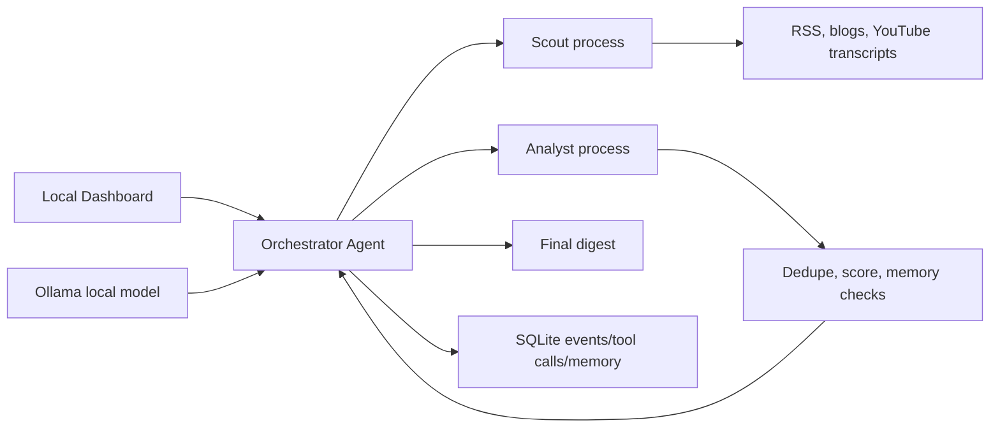

# Signal Stream Architecture

Signal Stream is designed as a local-first agent runtime. The Orchestrator is the only component with decision rights; Scout and Analyst are independent worker processes with bounded tools and isolated contexts.

## Why This Fits Signal Stream

- The Orchestrator chooses actions based on observations, which makes the system agentic rather than a fixed automation.
- Scout and Analyst are separate processes, so they are real subagents for the local MVP.
- Memory is SQLite, so the system can avoid repeating prior coverage.
- The dashboard exposes the agent trace, which makes behavior inspectable during demos.

## Upgrade Path

- Add email and Slack delivery once local dashboard runs are trusted.
- Add hosted API support behind the same Ollama client interface.
- Add embeddings for better clustering and memory matching.
- Add a scheduler or hosted runtime after on-demand agent behavior is stable.
