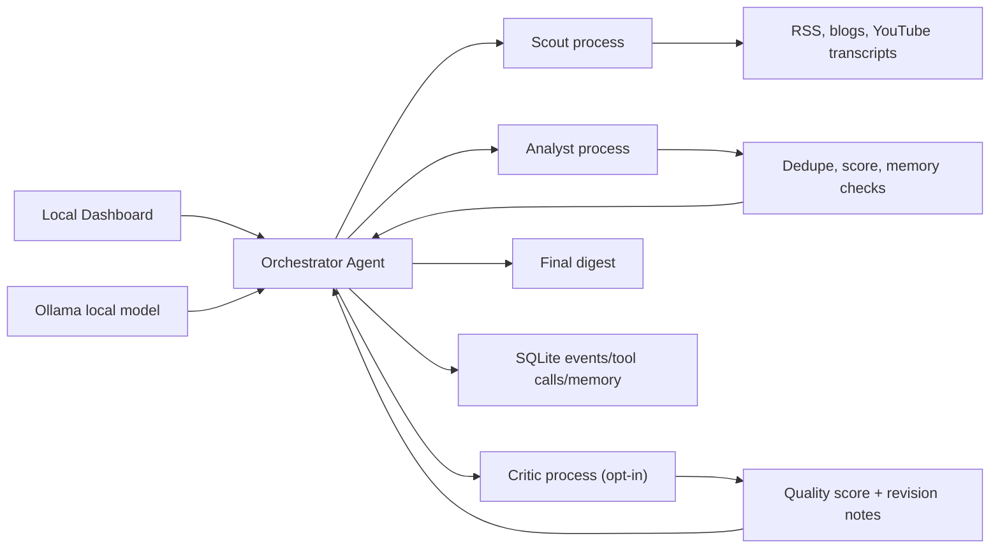

# Signal Stream Architecture

Signal Stream is designed as a local-first agent runtime. The Orchestrator is the only component with decision rights; Scout and Analyst are independent worker processes with bounded tools and isolated contexts.

## Why This Fits Signal Stream

- The Orchestrator chooses actions based on observations, which makes the system agentic rather than a fixed automation.
- Scout and Analyst are separate processes, so they are real subagents for the local MVP.
- The Critic closes the loop: instead of shipping immediately after the Analyst, the Orchestrator can request a review pass and revise before finalizing. This is the reflection step that separates an agentic system from a pipeline.
- Memory is SQLite, so the system can avoid repeating prior coverage.
- The dashboard exposes the agent trace, which makes behavior inspectable during demos.

## Critic / Reflection Loop

When `enable_critic = true` (in `configs/agent_brain.toml`), the Orchestrator gains a new action: `critique_digest`. After the Analyst produces ranked signals, the Orchestrator picks `critique_digest` and the Critic worker scores the digest 0–100. If the score is below `critic_score_threshold` and revision rounds remain, the Critic's revision notes are added to the Orchestrator's next decision context, prompting it to `analyze_articles` again or `collect_more_context`. The loop exits when the score is at or above the threshold, or `max_critic_rounds` is exhausted.

## Upgrade Path

- Add email and Slack delivery once local dashboard runs are trusted.
- Add hosted API support behind the same Ollama client interface.
- Add embeddings for better clustering and memory matching.
- Add a scheduler or hosted runtime after on-demand agent behavior is stable.
